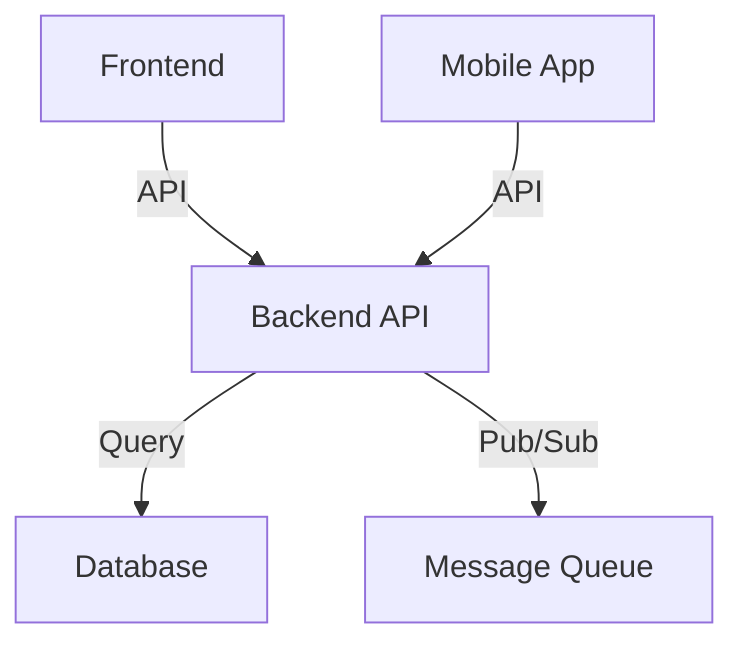

# Workspace Landscape Report

> Generated on {DATE} | Focus: {SCOPE}

## Executive Summary

| Metric | Count |
|--------|-------|
| **Total Projects** | {COUNT} |
| **Primary Languages** | {LANGUAGES} |
| **Deployment Targets** | {TARGETS} |
| **Shared Services** | {SHARED_COUNT} |
| **Tech Debt Items** | {DEBT_COUNT} |

**Recommended Priority**: {PRIORITY_RECOMMENDATION}

---

## Projects by Tech Stack

### Frontend (Web & Mobile)

| Project | Path | Stack | Version | Status |
|---------|------|-------|---------|--------|
| {name} | {path} | TypeScript/React | {version} | {status} |

**Key Points**: 
- ...
- Modernization opportunity: ...

### Backend & APIs

| Project | Path | Stack | Version | Status |
|---------|------|-------|---------|--------|
| {name} | {path} | Node.js/Express | {version} | {status} |

**Key Points**:
- ...

### Infrastructure & Tooling

| Project | Path | Purpose | Tech | Status |
|---------|------|---------|------|--------|
| {name} | {path} | {purpose} | Docker/K8s | {status} |

---

## Service Dependency Map

**Key Relationships**:
- {project} depends on {project}
- Shared service: {service} used by {projects}
- Circular dependency risk: {if any}

---

## Tech Stack Distribution

| Language | Count | Projects |
|----------|-------|----------|
| TypeScript | {n} | {list} |
| Python | {n} | {list} |
| Java | {n} | {list} |

**Standardization Opportunity**: Consider establishing team guidelines for {tech} projects.

---

## Modernization Opportunities

### Critical (Address First)

- [ ] **Project X**: Update Node.js from v14 → v20 (end of life: {date})
- [ ] **Project Y**: Fix {n} CVEs in dependencies

### Important (Address This Quarter)

- [ ] **Version drift**: {library} at versions {v1}, {v2}, {v3} across projects — standardize to {latest}
- [ ] **Tech debt**: {project} still uses {deprecated_tech} — migrate to {recommended}

### Nice to Have (Consider)

- [ ] Consolidate build configs across similar projects
- [ ] Extract shared utilities into monorepo packages
- [ ] Standardize CI/CD workflows

---

## Quick Reference: All Projects

| # | Project | Path | Type | Tech | Deps | Updated |
|---|---------|------|------|------|------|---------|
| 1 | {name} | {path} | Frontend | TS/React | {count} | {date} |
| 2 | {name} | {path} | Backend | Node/Express | {count} | {date} |

---

## Next Actions

1. **Review priorities** — Prioritize modernization items by business impact
2. **Assign owners** — Clarify project ownership and maintenance responsibilities
3. **Plan upgrades** — Schedule version updates and tech debt work
4. **Standardize** — Apply consistent patterns to similar projects
5. **Document** — Create project runbooks and onboarding guides

**Report generated**: {TIMESTAMP}  
**Scan duration**: {DURATION}  
**Scanned by**: Workspace Reconnaissance Skill
