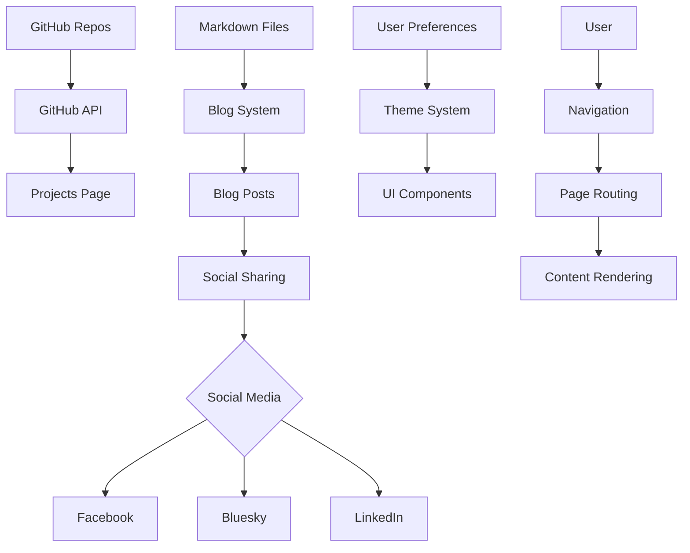

# Architectural Plan for emscapeforge.com

## 1. Project Foundation

### Technology Stack
- **Framework**: Astro (as preferred)
- **Styling**: CSS/SCSS with custom theming for light/dark mode
- **Animation**: Framer Motion for animations and transitions
- **Deployment**: GitHub Pages
- **Version Control**: Git/GitHub

### Project Structure

```
emscapeforge/
├── public/                 # Static assets
│   ├── favicon.ico
│   ├── robots.txt
│   ├── CNAME               # For custom domain
│   └── images/             # Global images
│       ├── banners/        # Site banners and hero images
│       └── profile/        # Profile pictures
├── src/
│   ├── components/         # Reusable UI components
│   │   ├── common/         # Shared components (Header, Footer, etc.)
│   │   ├── home/           # Home page components
│   │   ├── projects/       # Projects page components
│   │   ├── blog/           # Blog page components
│   │   └── about/          # About page components
│   ├── layouts/            # Page layouts
│   ├── pages/              # Page routes
│   │   ├── index.astro     # Home page
│   │   ├── projects.astro  # Projects page
│   │   ├── blog/           # Blog pages
│   │   │   ├── index.astro # Blog listing
│   │   │   └── [slug].astro # Dynamic blog post route
│   │   └── about.astro     # About page
│   ├── posts/              # Blog post content (Markdown)
│   ├── images/             # Content images
│   │   ├── blog/           # Blog post images (organized by post slug)
│   │   └── projects/       # Project screenshots
│   ├── design-assets/      # Design files
│   │   └── inspiration/    # Design inspiration images
│   ├── styles/             # Global styles
│   ├── utils/              # Utility functions
│   └── config.js           # Site configuration
├── astro.config.mjs        # Astro configuration
├── package.json
└── tsconfig.json
```

## 2. Design System

### Theme Configuration

```javascript
// src/styles/theme.js
export default {
  colors: {
    primary: {
      light: '#00B5AD', // Teal
      dark: '#008B8B'    // Dark Teal
    },
    secondary: {
      light: '#40E0D0', // Aqua
      dark: '#20B2AA'    // Dark Aqua
    },
    accent: {
      light: '#FF8C00', // Orange
      dark: '#FF7F50'    // Dark Orange
    },
    background: {
      light: '#FFFFFF',
      dark: '#121212'
    },
    text: {
      light: '#333333',
      dark: '#F5F5F5'
    }
  },
  fonts: {
    body: 'Inter, system-ui, sans-serif',
    heading: 'Montserrat, Georgia, serif'
  },
  borderRadius: {
    small: '4px',
    medium: '8px',
    large: '16px'
  },
  shadows: {
    small: '0 2px 4px rgba(0,0,0,0.1)',
    medium: '0 4px 8px rgba(0,0,0,0.1)',
    large: '0 8px 16px rgba(0,0,0,0.1)'
  },
  transitions: {
    default: '0.3s ease',
    slow: '0.5s ease',
    fast: '0.15s ease'
  }
}
```

### Component Design

All components will follow these design principles:
- Rounded corners (medium by default)
- Soft shadows for elevated elements
- Consistent spacing using a 4px/8px grid
- Subtle Celtic/Nordic accents for decorative elements
- Responsive design with mobile-first approach
- Accessible (WCAG AA compliant)

## 3. Core Components

### Navigation

```jsx
// src/components/common/Navigation.jsx
import { useState, useEffect } from 'react';
import ThemeToggle from './ThemeToggle';
import Logo from './Logo';

const Navigation = () => {
  const [isScrolled, setIsScrolled] = useState(false);
  
  // Shrink nav on scroll
  useEffect(() => {
    const handleScroll = () => {
      setIsScrolled(window.scrollY > 50);
    };
    window.addEventListener('scroll', handleScroll);
    return () => window.removeEventListener('scroll', handleScroll);
  }, []);
  
  return (
    <nav className={`site-nav ${isScrolled ? 'scrolled' : ''}`}>
      <Logo />
      <div className="nav-links">
        <a href="/">Home</a>
        <a href="/projects">Projects</a>
        <a href="/blog">Blog</a>
        <a href="/about">About</a>
      </div>
      <ThemeToggle />
    </nav>
  );
};

export default Navigation;
```

### Theme Toggle

```jsx
// src/components/common/ThemeToggle.jsx
import { useState, useEffect } from 'react';

const ThemeToggle = () => {
  const [isDark, setIsDark] = useState(false);
  
  useEffect(() => {
    // Check user preference
    const prefersDark = window.matchMedia('(prefers-color-scheme: dark)').matches;
    setIsDark(localStorage.getItem('theme') === 'dark' || (!localStorage.getItem('theme') && prefersDark));
    
    // Apply theme
    document.documentElement.classList.toggle('dark-mode', isDark);
  }, [isDark]);
  
  const toggleTheme = () => {
    const newTheme = !isDark ? 'dark' : 'light';
    localStorage.setItem('theme', newTheme);
    setIsDark(!isDark);
  };
  
  return (
    <button 
      onClick={toggleTheme} 
      aria-label={`Switch to ${isDark ? 'light' : 'dark'} mode`}
      className="theme-toggle"
    >
      {isDark ? '☀️' : '🌙'}
    </button>
  );
};

export default ThemeToggle;
```

### Ad Block Component (Hidden by Default)

```jsx
// src/components/common/AdBlock.jsx
import { useState, useEffect } from 'react';
import config from '../../config';

const AdBlock = ({ position, type = 'adsense' }) => {
  const [isVisible, setIsVisible] = useState(false);
  
  useEffect(() => {
    // Check if ads are enabled in config
    setIsVisible(config.features.ads.enabled);
  }, []);
  
  if (!isVisible) return null;
  
  return (
    <div className={`ad-container ad-${position}`} data-ad-type={type}>
      {type === 'adsense' && (
        <div className="adsense-container">
          {/* Google AdSense code would go here */}
          <div className="ad-placeholder">Ad Space</div>
        </div>
      )}
      {type === 'carbon' && (
        <div className="carbon-container">
          {/* Carbon Ads code would go here */}
          <div className="ad-placeholder">Carbon Ad</div>
        </div>
      )}
      {type === 'custom' && (
        <div className="custom-ad-container">
          {/* Custom ad HTML would go here */}
          <div className="ad-placeholder">Custom Ad</div>
        </div>
      )}
    </div>
  );
};

export default AdBlock;
```

## 4. Page Implementation

### Home Page

```jsx
// src/pages/index.astro
---
import Layout from '../layouts/MainLayout.astro';
import HeroSection from '../components/home/HeroSection';
import FeaturedProjects from '../components/home/FeaturedProjects';
import RecentPosts from '../components/home/RecentPosts';
---

<Layout title="Emscape Forge - Home">
  <HeroSection />
  <FeaturedProjects />
  <RecentPosts />
</Layout>
```

### Projects Page with GitHub API Integration

```jsx
// src/pages/projects.astro
---
import Layout from '../layouts/MainLayout.astro';
import ProjectsList from '../components/projects/ProjectsList';
import { fetchGitHubProjects } from '../utils/github';

// Fetch pinned repos from GitHub
const githubProjects = await fetchGitHubProjects('emscape');
---

<Layout title="Projects - Emscape Forge">
  <h1>Projects</h1>
  <ProjectsList projects={githubProjects} />
</Layout>
```

```javascript
// src/utils/github.js
export async function fetchGitHubProjects(username) {
  try {
    // Fetch pinned repositories
    const response = await fetch(`https://api.github.com/users/${username}/repos?sort=updated&per_page=10`);
    const repos = await response.json();
    
    // Process and return the data
    return repos.map(repo => ({
      name: repo.name,
      description: repo.description,
      language: repo.language,
      url: repo.html_url,
      updatedAt: repo.updated_at,
      stars: repo.stargazers_count,
      forks: repo.forks_count
    }));
  } catch (error) {
    console.error('Error fetching GitHub projects:', error);
    return [];
  }
}
```

### Blog System

```jsx
// src/pages/blog/index.astro
---
import Layout from '../../layouts/MainLayout.astro';
import BlogPostCard from '../../components/blog/BlogPostCard';
import { getAllPosts } from '../../utils/blog';

const posts = await getAllPosts();
---

<Layout title="Blog - Emscape Forge">
  <h1>Blog</h1>
  <div class="blog-posts-grid">
    {posts.map(post => (
      <BlogPostCard post={post} />
    ))}
  </div>
</Layout>
```

```jsx
// src/pages/blog/[slug].astro
---
import Layout from '../../layouts/MainLayout.astro';
import BlogPost from '../../components/blog/BlogPost';
import { getAllPosts, getPostBySlug } from '../../utils/blog';
import { shareToSocial } from '../../utils/social';

export async function getStaticPaths() {
  const posts = await getAllPosts();
  return posts.map(post => ({
    params: { slug: post.slug },
    props: { post }
  }));
}

const { post } = Astro.props;

// Handle social sharing if this is a new post
if (post.isNew) {
  await shareToSocial(post, ['facebook', 'bluesky']);
}
---

<Layout title={`${post.title} - Emscape Forge`}>
  <BlogPost post={post} />
</Layout>
```

```javascript
// src/utils/blog.js
import { promises as fs } from 'fs';
import path from 'path';
import matter from 'gray-matter';
import { marked } from 'marked';

export async function getAllPosts() {
  const postsDirectory = path.join(process.cwd(), 'src/posts');
  const filenames = await fs.readdir(postsDirectory);
  
  const posts = await Promise.all(filenames
    .filter(filename => filename.endsWith('.md'))
    .map(async filename => {
      const filePath = path.join(postsDirectory, filename);
      const fileContents = await fs.readFile(filePath, 'utf8');
      const { data, content } = matter(fileContents);
      
      return {
        slug: filename.replace('.md', ''),
        title: data.title,
        date: data.date,
        tags: data.tags || [],
        excerpt: data.excerpt || '',
        featuredImage: data.featuredImage,
        author: data.author || 'Emily',
        content: marked(content),
        isNew: new Date(data.date) > new Date(Date.now() - 24 * 60 * 60 * 1000) // Is it less than 24 hours old?
      };
    }));
  
  // Sort posts by date (newest first)
  return posts.sort((a, b) => new Date(b.date) - new Date(a.date));
}

export async function getPostBySlug(slug) {
  const posts = await getAllPosts();
  return posts.find(post => post.slug === slug);
}
```

### Social Sharing Utility

```javascript
// src/utils/social.js
export async function shareToSocial(post, platforms) {
  // Only run this on the server during build
  if (typeof window !== 'undefined') return;
  
  const message = `New blog post: ${post.title}\n${post.excerpt}\n\nhttps://emscapeforge.com/blog/${post.slug}`;
  
  for (const platform of platforms) {
    try {
      switch (platform) {
        case 'facebook':
          // Facebook sharing logic
          console.log(`Shared to Facebook: ${message}`);
          break;
        case 'bluesky':
          // Bluesky sharing logic
          console.log(`Shared to Bluesky: ${message}`);
          break;
        case 'linkedin':
          // LinkedIn sharing logic (optional)
          console.log(`Shared to LinkedIn: ${message}`);
          break;
      }
    } catch (error) {
      console.error(`Error sharing to ${platform}:`, error);
    }
  }
}
```

## 5. Animation System

```javascript
// src/utils/animations.js
import { motion } from 'framer-motion';

// Reusable animation variants
export const fadeIn = {
  hidden: { opacity: 0 },
  visible: { 
    opacity: 1,
    transition: { duration: 0.6 }
  }
};

export const slideUp = {
  hidden: { y: 50, opacity: 0 },
  visible: { 
    y: 0, 
    opacity: 1,
    transition: { duration: 0.5 }
  }
};

export const staggerChildren = {
  hidden: { opacity: 0 },
  visible: {
    opacity: 1,
    transition: {
      staggerChildren: 0.1
    }
  }
};

// Higher-order component for animated elements
export function withAnimation(Component, variants = fadeIn) {
  return (props) => (
    <motion.div
      initial="hidden"
      animate="visible"
      variants={variants}
    >
      <Component {...props} />
    </motion.div>
  );
}
```

## 6. Deployment Strategy

### GitHub Pages Setup

1. Configure Astro for GitHub Pages:

```javascript
// astro.config.mjs
import { defineConfig } from 'astro/config';

export default defineConfig({
  site: 'https://emscape.github.io',
  base: '/EmscapeForge',
  outDir: './dist',
  build: {
    assets: 'assets'
  }
});
```

2. GitHub Actions Workflow:

```yaml
# .github/workflows/deploy.yml
name: Deploy to GitHub Pages

on:
  push:
    branches: [main]
  workflow_dispatch:

jobs:
  build-and-deploy:
    runs-on: ubuntu-latest
    steps:
      - name: Checkout
        uses: actions/checkout@v3
      
      - name: Setup Node.js
        uses: actions/setup-node@v3
        with:
          node-version: 18
          
      - name: Install dependencies
        run: npm ci
        
      - name: Build
        run: npm run build
        
      - name: Deploy to GitHub Pages
        uses: JamesIves/github-pages-deploy-action@v4
        with:
          folder: dist
          branch: gh-pages
```

3. Custom Domain Setup:

```
# public/CNAME
emscapeforge.com
```

## 7. Implementation Plan

### Phase 1: Project Setup and Core Structure
1. Initialize Astro project
2. Set up project structure
3. Implement theme system and design tokens
4. Create base layout and common components
5. Configure GitHub repository and deployment workflow

### Phase 2: Page Implementation
1. Implement Home page with hero animation
2. Create Projects page with GitHub API integration
3. Build Blog system with Markdown support
4. Develop About page with bio and skills sections

### Phase 3: Features and Enhancements
1. Add light/dark mode toggle
2. Implement animations and transitions
3. Create responsive design for all screen sizes
4. Add social sharing functionality for blog posts
5. Set up SEO optimization

### Phase 4: Optional Features
1. Scaffold ad support components (hidden by default)
2. Add RSS feed for blog
3. Prepare for future newsletter integration
4. Set up PWA manifest and service worker placeholders
5. Configure sitemap and robots.txt

## 8. Architecture Diagram

```mermaid
graph TD
    A[User] --> B[GitHub Pages]
    B --> C[Astro Framework]
    C --> D[Pages]
    C --> E[Components]
    C --> F[Utilities]
    
    D --> D1[Home]
    D --> D2[Projects]
    D --> D3[Blog]
    D --> D4[About]
    
    E --> E1[Common Components]
    E --> E2[Page-specific Components]
    
    F --> F1[GitHub API]
    F --> F2[Blog System]
    F --> F3[Social Sharing]
    F --> F4[Animation System]
    
    G[Content] --> D3
    G --> D4
    
    H[GitHub API] --> F1
    
    I[Social Media] <-- F3
```

## 9. Data Flow Diagram



## 10. Image Organization

For organizing images and assets:

1. **Design inspiration images**: 
   - Place in `/src/design-assets/inspiration/`
   - Used during development, not deployed to production

2. **Site banners and hero images**: 
   - Place in `/public/images/banners/`
   - Global site imagery, accessible site-wide

3. **Profile pictures**: 
   - Place in `/public/images/profile/`
   - For about page and author information

4. **Blog post images**: 
   - Place in `/src/images/blog/[post-slug]/`
   - Where [post-slug] matches your blog post filename
   - Images will be automatically processed and optimized

5. **Project screenshots**: 
   - Place in `/src/images/projects/`
   - Used in project cards and detail pages