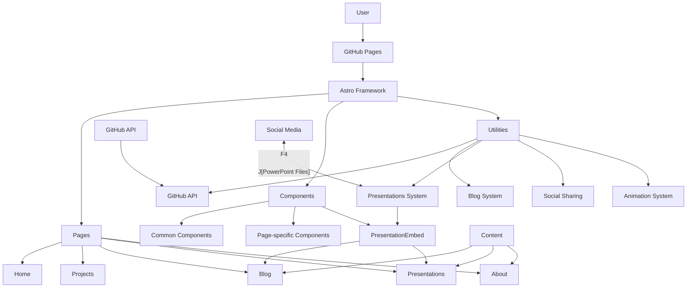
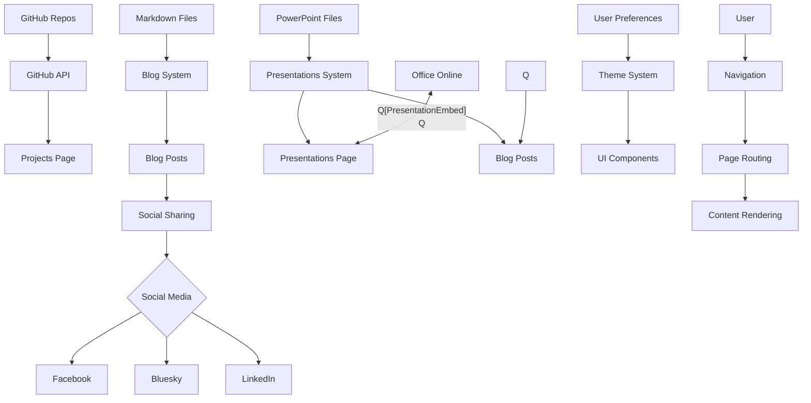

# Architectural Plan for emscapeforge.com

## 1. Project Foundation

### Technology Stack
- **Framework**: Astro (as preferred)
- **Styling**: CSS/SCSS with custom theming for light/dark mode
- **Animation**: Framer Motion for animations and transitions
- **Deployment**: GitHub Pages
- **Version Control**: Git/GitHub

### Project Structure

```
emscapeforge/
├── public/                 # Static assets
│   ├── favicon.ico
│   ├── robots.txt
│   ├── CNAME               # For custom domain
│   ├── presentations/      # PowerPoint files and fallbacks
│   │   ├── example.pptx
│   │   ├── example.pdf     # PDF fallback
│   │   └── example/        # Extracted slide images
│   └── images/             # Global images
│       ├── banners/        # Site banners and hero images
│       └── profile/        # Profile pictures
├── src/
│   ├── components/         # Reusable UI components
│   │   ├── common/         # Shared components (Header, Footer, etc.)
│   │   ├── home/           # Home page components
│   │   ├── projects/       # Projects page components
│   │   ├── blog/           # Blog page components
│   │   ├── presentations/  # Presentations page components
│   │   └── about/          # About page components
│   ├── layouts/            # Page layouts
│   ├── pages/              # Page routes
│   │   ├── index.astro     # Home page
│   │   ├── projects.astro  # Projects page
│   │   ├── blog/           # Blog pages
│   │   │   ├── index.astro # Blog listing
│   │   │   └── [slug].astro # Dynamic blog post route
│   │   ├── presentations/  # Presentations pages
│   │   │   ├── index.astro # Presentations listing
│   │   │   └── [slug].astro # Dynamic presentation route
│   │   └── about.astro     # About page
│   ├── posts/              # Blog post content (Markdown)
│   ├── images/             # Content images
│   │   ├── blog/           # Blog post images (organized by post slug)
│   │   ├── projects/       # Project screenshots
│   │   └── presentations/  # Presentation thumbnails and previews
│   ├── design-assets/      # Design files
│   │   └── inspiration/    # Design inspiration images
│   ├── styles/             # Global styles
│   ├── utils/              # Utility functions
│   └── config.js           # Site configuration
├── astro.config.mjs        # Astro configuration
├── package.json
└── tsconfig.json
```

## 2. Design System

### Theme Configuration

```javascript
// src/styles/theme.js
export default {
  colors: {
    primary: {
      light: '#00B5AD', // Teal
      dark: '#008B8B'    // Dark Teal
    },
    secondary: {
      light: '#40E0D0', // Aqua
      dark: '#20B2AA'    // Dark Aqua
    },
    accent: {
      light: '#FF8C00', // Orange
      dark: '#FF7F50'    // Dark Orange
    },
    background: {
      light: '#FFFFFF',
      dark: '#121212'
    },
    text: {
      light: '#333333',
      dark: '#F5F5F5'
    }
  },
  fonts: {
    body: 'Inter, system-ui, sans-serif',
    heading: 'Montserrat, Georgia, serif'
  },
  borderRadius: {
    small: '4px',
    medium: '8px',
    large: '16px'
  },
  shadows: {
    small: '0 2px 4px rgba(0,0,0,0.1)',
    medium: '0 4px 8px rgba(0,0,0,0.1)',
    large: '0 8px 16px rgba(0,0,0,0.1)'
  },
  transitions: {
    default: '0.3s ease',
    slow: '0.5s ease',
    fast: '0.15s ease'
  }
}
```

### Component Design

All components will follow these design principles:
- Rounded corners (medium by default)
- Soft shadows for elevated elements
- Consistent spacing using a 4px/8px grid
- Subtle Celtic/Nordic accents for decorative elements
- Responsive design with mobile-first approach
- Accessible (WCAG AA compliant)

## 3. Core Components

### Navigation

```jsx
// src/components/common/Navigation.jsx
import { useState, useEffect } from 'react';
import ThemeToggle from './ThemeToggle';
import Logo from './Logo';

const Navigation = () => {
  const [isScrolled, setIsScrolled] = useState(false);
  
  // Shrink nav on scroll
  useEffect(() => {
    const handleScroll = () => {
      setIsScrolled(window.scrollY > 50);
    };
    window.addEventListener('scroll', handleScroll);
    return () => window.removeEventListener('scroll', handleScroll);
  }, []);
  
  return (
    <nav className={`site-nav ${isScrolled ? 'scrolled' : ''}`}>
      <Logo />
      <div className="nav-links">
        <a href="/">Home</a>
        <a href="/projects">Projects</a>
        <a href="/blog">Blog</a>
        <a href="/presentations">Presentations</a>
        <a href="/about">About</a>
      </div>
      <ThemeToggle />
    </nav>
  );
};

export default Navigation;
```

### Theme Toggle

```jsx
// src/components/common/ThemeToggle.jsx
import { useState, useEffect } from 'react';

const ThemeToggle = () => {
  const [isDark, setIsDark] = useState(false);
  
  useEffect(() => {
    // Check user preference
    const prefersDark = window.matchMedia('(prefers-color-scheme: dark)').matches;
    setIsDark(localStorage.getItem('theme') === 'dark' || (!localStorage.getItem('theme') && prefersDark));
    
    // Apply theme
    document.documentElement.classList.toggle('dark-mode', isDark);
  }, [isDark]);
  
  const toggleTheme = () => {
    const newTheme = !isDark ? 'dark' : 'light';
    localStorage.setItem('theme', newTheme);
    setIsDark(!isDark);
  };
  
  return (
    <button 
      onClick={toggleTheme} 
      aria-label={`Switch to ${isDark ? 'light' : 'dark'} mode`}
      className="theme-toggle"
    >
      {isDark ? '☀️' : '🌙'}
    </button>
  );
};

export default ThemeToggle;
```

### Ad Block Component (Hidden by Default)

```jsx
// src/components/common/AdBlock.jsx
import { useState, useEffect } from 'react';
import config from '../../config';

const AdBlock = ({ position, type = 'adsense' }) => {
  const [isVisible, setIsVisible] = useState(false);
  
  useEffect(() => {
    // Check if ads are enabled in config
    setIsVisible(config.features.ads.enabled);
  }, []);
  
  if (!isVisible) return null;
  
  return (
    <div className={`ad-container ad-${position}`} data-ad-type={type}>
      {type === 'adsense' && (
        <div className="adsense-container">
          {/* Google AdSense code would go here */}
          <div className="ad-placeholder">Ad Space</div>
        </div>
      )}
      {type === 'carbon' && (
        <div className="carbon-container">
          {/* Carbon Ads code would go here */}
          <div className="ad-placeholder">Carbon Ad</div>
        </div>
      )}
      {type === 'custom' && (
        <div className="custom-ad-container">
          {/* Custom ad HTML would go here */}
          <div className="ad-placeholder">Custom Ad</div>
        </div>
      )}
    </div>
  );
};

export default AdBlock;
```

## 4. Page Implementation

### Home Page

```jsx
// src/pages/index.astro
---
import Layout from '../layouts/MainLayout.astro';
import HeroSection from '../components/home/HeroSection';
import FeaturedProjects from '../components/home/FeaturedProjects';
import RecentPosts from '../components/home/RecentPosts';
---

<Layout title="Emscape Forge - Home">
  <HeroSection />
  <FeaturedProjects />
  <RecentPosts />
</Layout>
```

### Projects Page with GitHub API Integration

```jsx
// src/pages/projects.astro
---
import Layout from '../layouts/MainLayout.astro';
import ProjectsList from '../components/projects/ProjectsList';
import { fetchGitHubProjects } from '../utils/github';

// Fetch pinned repos from GitHub
const githubProjects = await fetchGitHubProjects('emscape');
---

<Layout title="Projects - Emscape Forge">
  <h1>Projects</h1>
  <ProjectsList projects={githubProjects} />
</Layout>
```

```javascript
// src/utils/github.js
export async function fetchGitHubProjects(username) {
  try {
    // Fetch pinned repositories
    const response = await fetch(`https://api.github.com/users/${username}/repos?sort=updated&per_page=10`);
    const repos = await response.json();
    
    // Process and return the data
    return repos.map(repo => ({
      name: repo.name,
      description: repo.description,
      language: repo.language,
      url: repo.html_url,
      updatedAt: repo.updated_at,
      stars: repo.stargazers_count,
      forks: repo.forks_count
    }));
  } catch (error) {
    console.error('Error fetching GitHub projects:', error);
    return [];
  }
}
```

### Blog System

```jsx
// src/pages/blog/index.astro
---
import Layout from '../../layouts/MainLayout.astro';
import BlogPostCard from '../../components/blog/BlogPostCard';
import { getAllPosts } from '../../utils/blog';

const posts = await getAllPosts();
---

<Layout title="Blog - Emscape Forge">
  <h1>Blog</h1>
  <div class="blog-posts-grid">
    {posts.map(post => (
      <BlogPostCard post={post} />
    ))}
  </div>
</Layout>
```

```jsx
// src/pages/blog/[slug].astro
---
import Layout from '../../layouts/MainLayout.astro';
import BlogPost from '../../components/blog/BlogPost';
import { getAllPosts, getPostBySlug } from '../../utils/blog';
import { shareToSocial } from '../../utils/social';

export async function getStaticPaths() {
  const posts = await getAllPosts();
  return posts.map(post => ({
    params: { slug: post.slug },
    props: { post }
  }));
}

const { post } = Astro.props;

// Handle social sharing if this is a new post
if (post.isNew) {
  await shareToSocial(post, ['facebook', 'bluesky']);
}
---

<Layout title={`${post.title} - Emscape Forge`}>
  <BlogPost post={post} />
</Layout>
```

```javascript
// src/utils/blog.js
import { promises as fs } from 'fs';
import path from 'path';
import matter from 'gray-matter';
import { marked } from 'marked';

export async function getAllPosts() {
  const postsDirectory = path.join(process.cwd(), 'src/posts');
  const filenames = await fs.readdir(postsDirectory);
  
  const posts = await Promise.all(filenames
    .filter(filename => filename.endsWith('.md'))
    .map(async filename => {
      const filePath = path.join(postsDirectory, filename);
      const fileContents = await fs.readFile(filePath, 'utf8');
      const { data, content } = matter(fileContents);
      
      return {
        slug: filename.replace('.md', ''),
        title: data.title,
        date: data.date,
        tags: data.tags || [],
        excerpt: data.excerpt || '',
        featuredImage: data.featuredImage,
        author: data.author || 'Emily',
        content: marked(content),
        isNew: new Date(data.date) > new Date(Date.now() - 24 * 60 * 60 * 1000) // Is it less than 24 hours old?
      };
    }));
  
  // Sort posts by date (newest first)
  return posts.sort((a, b) => new Date(b.date) - new Date(a.date));
}

export async function getPostBySlug(slug) {
  const posts = await getAllPosts();
  return posts.find(post => post.slug === slug);
}
```

### PowerPoint Embedding Component

```jsx
// src/components/blog/PresentationEmbed.jsx
import { useState, useEffect } from 'react';
import { useTheme } from '../../context/ThemeContext';

const PresentationEmbed = ({ src, title, fallbackMode = 'auto' }) => {
  const [isLoading, setIsLoading] = useState(true);
  const [viewMode, setViewMode] = useState('online'); // 'online', 'pdf', 'images'
  const { isDarkMode } = useTheme();
  
  useEffect(() => {
    // Determine best view mode based on connection, device, etc.
    const determineViewMode = () => {
      if (fallbackMode !== 'auto') return fallbackMode;
      
      // Check if mobile
      const isMobile = window.innerWidth < 768;
      // Check connection speed (simplified)
      const isSlowConnection = navigator.connection && 
        (navigator.connection.effectiveType === '2g' || navigator.connection.effectiveType === 'slow-2g');
        
      if (isMobile || isSlowConnection) {
        return 'images';
      }
      
      return 'online';
    };
    
    setViewMode(determineViewMode());
    setIsLoading(false);
  }, [fallbackMode]);
  
  // Encode the URL for Office Online
  const encodedSrc = encodeURIComponent(
    // Convert relative path to absolute URL
    src.startsWith('http') ? src : `https://emscapeforge.com/presentations/${src}`
  );
  
  // Office Online embed URL
  const officeEmbedUrl = `https://view.officeapps.live.com/op/embed.aspx?src=${encodedSrc}`;
  
  // PDF fallback URL (assuming we have a conversion service)
  const pdfUrl = src.replace('.pptx', '.pdf');
  
  // Image gallery paths (assuming we extract images from presentations)
  const imageBasePath = src.replace('.pptx', '/');
  
  return (
    <div className={`presentation-embed ${isDarkMode ? 'dark' : 'light'}`}>
      <div className="presentation-header">
        <h3>{title || 'Embedded Presentation'}</h3>
        {viewMode !== 'online' && (
          <button onClick={() => setViewMode('online')}>
            Switch to Interactive Mode
          </button>
        )}
      </div>
      
      {isLoading ? (
        <div className="presentation-loading">Loading presentation...</div>
      ) : (
        <>
          {viewMode === 'online' && (
            <iframe 
              src={officeEmbedUrl}
              width="100%" 
              height="600" 
              frameBorder="0" 
              title={title || 'Embedded Presentation'}
              allowFullScreen
            />
          )}
          
          {viewMode === 'pdf' && (
            <iframe 
              src={`/pdf-viewer.html?file=${pdfUrl}`}
              width="100%" 
              height="600" 
              frameBorder="0" 
              title={title || 'Embedded Presentation (PDF)'}
            />
          )}
          
          {viewMode === 'images' && (
            <div className="presentation-gallery">
              {/* Image gallery component would go here */}
              <p>Slide gallery view (simplified for this example)</p>
            </div>
          )}
        </>
      )}
      
      <div className="presentation-footer">
        <a href={src} download>Download Original Presentation</a>
      </div>
    </div>
  );
};

export default PresentationEmbed;
```

### Presentations Page

```jsx
// src/pages/presentations/index.astro
---
import Layout from '../../layouts/MainLayout.astro';
import PresentationList from '../../components/presentations/PresentationList';
import { getAllPresentations } from '../../utils/presentations';

const presentations = await getAllPresentations();
const featuredPresentations = presentations.filter(p => p.featured);
---

<Layout title="Presentations - Emscape Forge">
  <div class="presentations-container">
    <h1>Presentations</h1>
    
    {featuredPresentations.length > 0 && (
      <section class="featured-presentations">
        <h2>Featured Presentations</h2>
        <PresentationList presentations={featuredPresentations} layout="featured" />
      </section>
    )}
    
    <section class="all-presentations">
      <h2>All Presentations</h2>
      <PresentationList presentations={presentations} layout="grid" />
    </section>
  </div>
</Layout>
```

```jsx
// src/pages/presentations/[slug].astro
---
import Layout from '../../layouts/MainLayout.astro';
import PresentationViewer from '../../components/presentations/PresentationViewer';
import { getAllPresentations, getPresentationBySlug } from '../../utils/presentations';

export async function getStaticPaths() {
  const presentations = await getAllPresentations();
  return presentations.map(presentation => ({
    params: { slug: presentation.slug },
    props: { presentation }
  }));
}

const { presentation } = Astro.props;
---

<Layout title={`${presentation.title} - Emscape Forge`}>
  <div class="presentation-page">
    <h1>{presentation.title}</h1>
    <p class="presentation-meta">
      <span class="date">{new Date(presentation.date).toLocaleDateString()}</span>
      <span class="author">by {presentation.author}</span>
    </p>
    
    <div class="presentation-description">
      <p>{presentation.description}</p>
    </div>
    
    <div class="tags">
      {presentation.tags.map(tag => (
        <span class="tag">{tag}</span>
      ))}
    </div>
    
    <PresentationViewer presentation={presentation} />
    
    <div class="presentation-actions">
      <a href={presentation.filePath} download class="download-btn">
        Download PowerPoint
      </a>
      <a href={presentation.pdfPath} download class="download-btn">
        Download PDF
      </a>
    </div>
  </div>
</Layout>
```

```jsx
// src/components/presentations/PresentationViewer.jsx
import { useState } from 'react';
import PresentationEmbed from '../blog/PresentationEmbed';

const PresentationViewer = ({ presentation }) => {
  const [viewMode, setViewMode] = useState('online'); // 'online', 'pdf', 'images'
  
  return (
    <div className="presentation-viewer">
      <div className="viewer-controls">
        <button 
          className={viewMode === 'online' ? 'active' : ''} 
          onClick={() => setViewMode('online')}
        >
          Interactive
        </button>
        <button 
          className={viewMode === 'pdf' ? 'active' : ''} 
          onClick={() => setViewMode('pdf')}
        >
          PDF
        </button>
        <button 
          className={viewMode === 'images' ? 'active' : ''} 
          onClick={() => setViewMode('images')}
        >
          Slides
        </button>
      </div>
      
      <PresentationEmbed 
        src={presentation.filePath} 
        title={presentation.title} 
        fallbackMode={viewMode} 
      />
    </div>
  );
};

export default PresentationViewer;
```

```javascript
// src/utils/presentations.js
import { promises as fs } from 'fs';
import path from 'path';

export async function getAllPresentations() {
  // In a real implementation, this would read from a data source
  // For now, we'll return mock data
  return [
    {
      slug: "introduction-to-astro",
      title: "Introduction to Astro Framework",
      description: "Learn the basics of the Astro framework for building fast, content-focused websites",
      date: "2025-03-15",
      tags: ["web development", "astro", "javascript"],
      thumbnailImage: "/images/presentations/introduction-to-astro/thumbnail.jpg",
      filePath: "/presentations/introduction-to-astro.pptx",
      pdfPath: "/presentations/introduction-to-astro.pdf",
      slideCount: 24,
      author: "Emily",
      featured: true
    },
    {
      slug: "responsive-design-patterns",
      title: "Modern Responsive Design Patterns",
      description: "Explore effective patterns for creating responsive websites that work on all devices",
      date: "2025-02-28",
      tags: ["design", "css", "responsive"],
      thumbnailImage: "/images/presentations/responsive-design-patterns/thumbnail.jpg",
      filePath: "/presentations/responsive-design-patterns.pptx",
      pdfPath: "/presentations/responsive-design-patterns.pdf",
      slideCount: 18,
      author: "Emily",
      featured: false
    }
    // Additional presentations would be listed here
  ];
}

export async function getPresentationBySlug(slug) {
  const presentations = await getAllPresentations();
  return presentations.find(p => p.slug === slug);
}
```

### Social Sharing Utility

```javascript
// src/utils/social.js
export async function shareToSocial(post, platforms) {
  // Only run this on the server during build
  if (typeof window !== 'undefined') return;
  
  const message = `New blog post: ${post.title}\n${post.excerpt}\n\nhttps://emscapeforge.com/blog/${post.slug}`;
  
  for (const platform of platforms) {
    try {
      switch (platform) {
        case 'facebook':
          // Facebook sharing logic
          console.log(`Shared to Facebook: ${message}`);
          break;
        case 'bluesky':
          // Bluesky sharing logic
          console.log(`Shared to Bluesky: ${message}`);
          break;
        case 'linkedin':
          // LinkedIn sharing logic (optional)
          console.log(`Shared to LinkedIn: ${message}`);
          break;
      }
    } catch (error) {
      console.error(`Error sharing to ${platform}:`, error);
    }
  }
}
```

## 5. Animation System

```javascript
// src/utils/animations.js
import { motion } from 'framer-motion';

// Reusable animation variants
export const fadeIn = {
  hidden: { opacity: 0 },
  visible: { 
    opacity: 1,
    transition: { duration: 0.6 }
  }
};

export const slideUp = {
  hidden: { y: 50, opacity: 0 },
  visible: { 
    y: 0, 
    opacity: 1,
    transition: { duration: 0.5 }
  }
};

export const staggerChildren = {
  hidden: { opacity: 0 },
  visible: {
    opacity: 1,
    transition: {
      staggerChildren: 0.1
    }
  }
};

// Higher-order component for animated elements
export function withAnimation(Component, variants = fadeIn) {
  return (props) => (
    <motion.div
      initial="hidden"
      animate="visible"
      variants={variants}
    >
      <Component {...props} />
    </motion.div>
  );
}
```

## 6. Deployment Strategy

### GitHub Pages Setup

1. Configure Astro for GitHub Pages:

```javascript
// astro.config.mjs
import { defineConfig } from 'astro/config';

export default defineConfig({
  site: 'https://emscape.github.io',
  base: '/EmscapeForge',
  outDir: './dist',
  build: {
    assets: 'assets'
  }
});
```

2. GitHub Actions Workflow:

```yaml
# .github/workflows/deploy.yml
name: Deploy to GitHub Pages

on:
  push:
    branches: [main]
  workflow_dispatch:

jobs:
  build-and-deploy:
    runs-on: ubuntu-latest
    steps:
      - name: Checkout
        uses: actions/checkout@v3
      
      - name: Setup Node.js
        uses: actions/setup-node@v3
        with:
          node-version: 18
          
      - name: Install dependencies
        run: npm ci
        
      - name: Build
        run: npm run build
        
      - name: Deploy to GitHub Pages
        uses: JamesIves/github-pages-deploy-action@v4
        with:
          folder: dist
          branch: gh-pages
```

3. Custom Domain Setup:

```
# public/CNAME
emscapeforge.com
```

## 7. Implementation Plan

### Phase 1: Project Setup and Core Structure
1. Initialize Astro project
2. Set up project structure
3. Implement theme system and design tokens
4. Create base layout and common components
5. Configure GitHub repository and deployment workflow

### Phase 2: Page Implementation
1. Implement Home page with hero animation
2. Create Projects page with GitHub API integration
3. Build Blog system with Markdown support
4. Develop Presentations page with PowerPoint embedding
5. Develop About page with bio and skills sections

### Phase 3: Features and Enhancements
1. Add light/dark mode toggle
2. Implement animations and transitions
3. Create responsive design for all screen sizes
4. Add social sharing functionality for blog posts
5. Set up SEO optimization
6. Implement PowerPoint embedding in blog posts

### Phase 4: Optional Features
1. Scaffold ad support components (hidden by default)
2. Add RSS feed for blog
3. Prepare for future newsletter integration
4. Set up PWA manifest and service worker placeholders
5. Configure sitemap and robots.txt

## 8. Architecture Diagram



## 9. Data Flow Diagram



## 10. Image Organization

For organizing images and assets:

1. **Design inspiration images**: 
   - Place in `/src/design-assets/inspiration/`
   - Used during development, not deployed to production

2. **Site banners and hero images**: 
   - Place in `/public/images/banners/`
   - Global site imagery, accessible site-wide

3. **Profile pictures**: 
   - Place in `/public/images/profile/`
   - For about page and author information

4. **Blog post images**: 
   - Place in `/src/images/blog/[post-slug]/`
   - Where [post-slug] matches your blog post filename
   - Images will be automatically processed and optimized

5. **Project screenshots**: 
   - Place in `/src/images/projects/`
   - Used in project cards and detail pages

6. **Presentation files and images**:
   - PowerPoint files: Place in `/public/presentations/`
   - PDF versions: Place in `/public/presentations/` with same name as PowerPoint file but .pdf extension
   - Slide images: Place in `/public/presentations/[presentation-name]/`
   - Thumbnails: Place in `/src/images/presentations/[presentation-slug]/thumbnail.jpg`