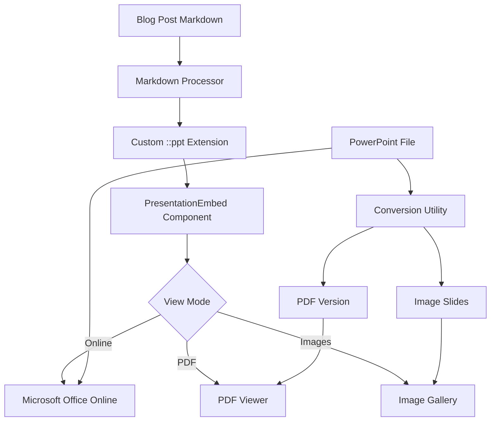

# PowerPoint Presentation Embedding Plan for EmscapeForge

## Overview

This plan outlines the implementation of PowerPoint presentation embedding functionality for the EmscapeForge blog system. This feature will allow blog posts to include interactive PowerPoint presentations directly within the content.

## Implementation Approaches

There are several approaches to embedding PowerPoint presentations in web content:

1. **Microsoft Office Online Embedding**
   - Uses Microsoft's Office Online service to render presentations
   - Requires the presentation to be stored on OneDrive/SharePoint
   - Provides full interactive viewing experience
   - Example embed code: `<iframe src="https://view.officeapps.live.com/op/embed.aspx?src=URL_TO_PPTX" width="100%" height="600px" frameborder="0"></iframe>`

2. **Google Slides Embedding**
   - Requires converting PowerPoint to Google Slides format
   - Good alternative if Microsoft's service isn't preferred
   - Example embed code: `<iframe src="https://docs.google.com/presentation/d/e/PRESENTATION_ID/embed" width="100%" height="600px" frameborder="0"></iframe>`

3. **PDF Conversion**
   - Convert PowerPoint to PDF and use a PDF viewer
   - Simpler but loses animations and interactivity
   - More universal compatibility

4. **Image Gallery**
   - Convert slides to images and display in a gallery/carousel
   - Simplest approach but loses all interactivity
   - Good fallback for mobile devices

## Recommended Approach

We recommend implementing the **Microsoft Office Online Embedding** as the primary method, with fallbacks to PDF or image gallery for offline viewing or performance optimization on mobile devices.

## Architecture Changes

### 1. Blog Post Markdown Extension

Create a custom Markdown extension to support PowerPoint embedding syntax:

```markdown
::ppt{src="path/to/presentation.pptx" title="My Presentation"}
```

### 2. Presentation Component

Create a new React component for rendering embedded presentations:

```jsx
// src/components/blog/PresentationEmbed.jsx
import { useState, useEffect } from 'react';
import { useTheme } from '../../context/ThemeContext';

const PresentationEmbed = ({ src, title, fallbackMode = 'auto' }) => {
  const [isLoading, setIsLoading] = useState(true);
  const [viewMode, setViewMode] = useState('online'); // 'online', 'pdf', 'images'
  const { isDarkMode } = useTheme();
  
  useEffect(() => {
    // Determine best view mode based on connection, device, etc.
    const determineViewMode = () => {
      if (fallbackMode !== 'auto') return fallbackMode;
      
      // Check if mobile
      const isMobile = window.innerWidth < 768;
      // Check connection speed (simplified)
      const isSlowConnection = navigator.connection && 
        (navigator.connection.effectiveType === '2g' || navigator.connection.effectiveType === 'slow-2g');
        
      if (isMobile || isSlowConnection) {
        return 'images';
      }
      
      return 'online';
    };
    
    setViewMode(determineViewMode());
    setIsLoading(false);
  }, [fallbackMode]);
  
  // Encode the URL for Office Online
  const encodedSrc = encodeURIComponent(
    // Convert relative path to absolute URL
    src.startsWith('http') ? src : `https://emscapeforge.com/presentations/${src}`
  );
  
  // Office Online embed URL
  const officeEmbedUrl = `https://view.officeapps.live.com/op/embed.aspx?src=${encodedSrc}`;
  
  // PDF fallback URL (assuming we have a conversion service)
  const pdfUrl = src.replace('.pptx', '.pdf');
  
  // Image gallery paths (assuming we extract images from presentations)
  const imageBasePath = src.replace('.pptx', '/');
  
  return (
    <div className={`presentation-embed ${isDarkMode ? 'dark' : 'light'}`}>
      <div className="presentation-header">
        <h3>{title || 'Embedded Presentation'}</h3>
        {viewMode !== 'online' && (
          <button onClick={() => setViewMode('online')}>
            Switch to Interactive Mode
          </button>
        )}
      </div>
      
      {isLoading ? (
        <div className="presentation-loading">Loading presentation...</div>
      ) : (
        <>
          {viewMode === 'online' && (
            <iframe 
              src={officeEmbedUrl}
              width="100%" 
              height="600" 
              frameBorder="0" 
              title={title || 'Embedded Presentation'}
              allowFullScreen
            />
          )}
          
          {viewMode === 'pdf' && (
            <iframe 
              src={`/pdf-viewer.html?file=${pdfUrl}`}
              width="100%" 
              height="600" 
              frameBorder="0" 
              title={title || 'Embedded Presentation (PDF)'}
            />
          )}
          
          {viewMode === 'images' && (
            <div className="presentation-gallery">
              {/* Image gallery component would go here */}
              <p>Slide gallery view (simplified for this example)</p>
            </div>
          )}
        </>
      )}
      
      <div className="presentation-footer">
        <a href={src} download>Download Original Presentation</a>
      </div>
    </div>
  );
};

export default PresentationEmbed;
```

### 3. Markdown Processor Extension

Extend the Markdown processor to handle the custom PowerPoint syntax:

```javascript
// src/utils/markdown-extensions.js
import { visit } from 'unist-util-visit';

// PowerPoint presentation plugin for remark
export function remarkPowerPoint() {
  return (tree) => {
    visit(tree, 'paragraph', (node, index, parent) => {
      const pptMatch = node.children?.[0]?.value?.match(/^::ppt{(.+)}$/);
      
      if (pptMatch) {
        const attributesStr = pptMatch[1];
        const attributes = {};
        
        // Parse attributes
        attributesStr.split(' ').forEach(attr => {
          const [key, value] = attr.split('=');
          if (key && value) {
            attributes[key] = value.replace(/"/g, '');
          }
        });
        
        // Replace the node with our custom component
        parent.children.splice(index, 1, {
          type: 'html',
          value: `<PresentationEmbed src="${attributes.src}" title="${attributes.title || ''}" fallbackMode="${attributes.fallback || 'auto'}" />`
        });
      }
    });
  };
}
```

### 4. Update Astro Configuration

Update the Astro configuration to include the custom Markdown extension:

```javascript
// astro.config.mjs
import { defineConfig } from 'astro/config';
import { remarkPowerPoint } from './src/utils/markdown-extensions';

export default defineConfig({
  // ... existing config
  markdown: {
    remarkPlugins: [remarkPowerPoint],
    // ... other markdown config
  }
});
```

### 5. Presentation Storage

Add a dedicated directory for storing presentations:

```
emscapeforge/
├── public/
│   ├── ...
│   └── presentations/        # Store PowerPoint files here
│       ├── presentation1.pptx
│       ├── presentation1.pdf  # PDF fallback
│       └── presentation1/     # Extracted slide images
│           ├── slide1.jpg
│           ├── slide2.jpg
│           └── ...
```

### 6. Conversion Utilities

Create utilities for converting PowerPoint to PDF and images:

```javascript
// src/utils/presentation-converter.js
// This would be a server-side utility used during build

import { exec } from 'child_process';
import { promisify } from 'util';
import fs from 'fs/promises';
import path from 'path';

const execAsync = promisify(exec);

// Convert PPTX to PDF using LibreOffice (server-side)
export async function convertPptxToPdf(pptxPath) {
  const pdfPath = pptxPath.replace('.pptx', '.pdf');
  await execAsync(`libreoffice --headless --convert-to pdf --outdir "${path.dirname(pptxPath)}" "${pptxPath}"`);
  return pdfPath;
}

// Extract images from PPTX (server-side)
export async function extractPptxImages(pptxPath) {
  const baseName = path.basename(pptxPath, '.pptx');
  const outputDir = path.join(path.dirname(pptxPath), baseName);
  
  // Create output directory
  await fs.mkdir(outputDir, { recursive: true });
  
  // Use a library like pptx-extractor or similar
  // This is a simplified example
  await execAsync(`pptx-image-extractor "${pptxPath}" -o "${outputDir}"`);
  
  return outputDir;
}
```

## Data Flow Diagram



## User Experience

1. **Content Creation**:
   - Author uploads PowerPoint file to `/public/presentations/`
   - Author adds `::ppt{src="presentation.pptx" title="My Presentation"}` to their Markdown
   - Build process automatically generates fallback formats

2. **Content Consumption**:
   - Desktop users see interactive Office Online embed by default
   - Mobile users see image gallery by default (for performance)
   - Users can switch between viewing modes
   - Download option always available for the original file

## Implementation Plan

### Phase 1: Basic Embedding
1. Create PresentationEmbed component
2. Implement custom Markdown extension
3. Set up presentation storage directory
4. Test with sample PowerPoint files

### Phase 2: Fallback Mechanisms
1. Implement PDF conversion utility
2. Create image extraction utility
3. Add view mode switching
4. Test on various devices and connection speeds

### Phase 3: Enhancement and Optimization
1. Add loading states and error handling
2. Implement responsive design for embeds
3. Add analytics for presentation interactions
4. Optimize performance for mobile devices

## Conclusion

This implementation will provide a robust solution for embedding PowerPoint presentations in blog posts, with appropriate fallbacks for different devices and connection speeds. The approach leverages Microsoft's Office Online service for the best interactive experience while ensuring compatibility across platforms.