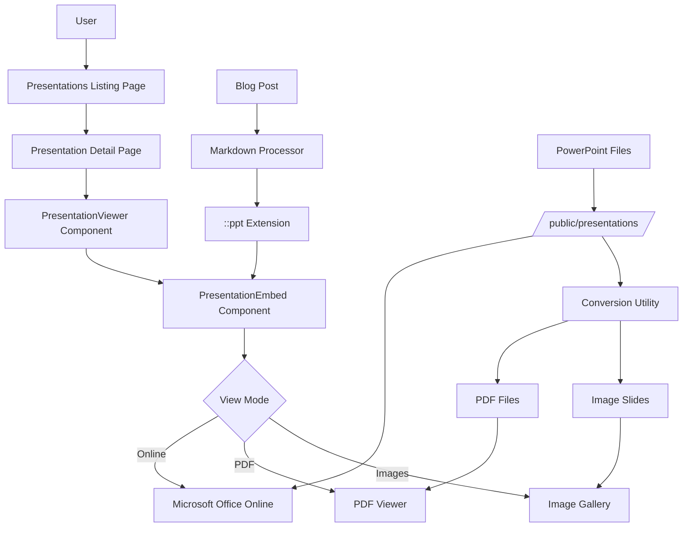

# Presentations Page and PowerPoint Embedding Integration Plan

## Overview

This plan outlines the addition of a dedicated Presentations page to the EmscapeForge website and its integration with the PowerPoint embedding functionality. The Presentations page will serve as a centralized location for accessing and viewing PowerPoint presentations, complementing the embedding functionality in blog posts.

## 1. Presentations Page Architecture

### Page Structure

```
emscapeforge/
├── src/
│   ├── pages/
│   │   ├── presentations/
│   │   │   ├── index.astro       # Main presentations listing page
│   │   │   └── [slug].astro      # Dynamic presentation viewer page
│   ├── components/
│   │   ├── presentations/
│   │   │   ├── PresentationCard.jsx    # Card for presentation listings
│   │   │   ├── PresentationViewer.jsx  # Full presentation viewer
│   │   │   ├── PresentationList.jsx    # Grid/list of presentations
│   │   │   └── PresentationEmbed.jsx   # Reusable embed component (shared with blog)
```

### Data Model

Each presentation will have the following metadata:

```javascript
{
  slug: "presentation-name",
  title: "Presentation Title",
  description: "Brief description of the presentation",
  date: "2025-03-23",
  tags: ["tag1", "tag2"],
  thumbnailImage: "/images/presentations/presentation-name/thumbnail.jpg",
  filePath: "/presentations/presentation-name.pptx",
  pdfPath: "/presentations/presentation-name.pdf",
  slideCount: 15,
  author: "Emily",
  featured: true|false
}
```

## 2. Page Implementation

### Presentations Listing Page

```jsx
// src/pages/presentations/index.astro
---
import Layout from '../../layouts/MainLayout.astro';
import PresentationList from '../../components/presentations/PresentationList';
import { getAllPresentations } from '../../utils/presentations';

const presentations = await getAllPresentations();
const featuredPresentations = presentations.filter(p => p.featured);
---

<Layout title="Presentations - Emscape Forge">
  <div class="presentations-container">
    <h1>Presentations</h1>
    
    {featuredPresentations.length > 0 && (
      <section class="featured-presentations">
        <h2>Featured Presentations</h2>
        <PresentationList presentations={featuredPresentations} layout="featured" />
      </section>
    )}
    
    <section class="all-presentations">
      <h2>All Presentations</h2>
      <PresentationList presentations={presentations} layout="grid" />
    </section>
  </div>
</Layout>
```

### Individual Presentation Page

```jsx
// src/pages/presentations/[slug].astro
---
import Layout from '../../layouts/MainLayout.astro';
import PresentationViewer from '../../components/presentations/PresentationViewer';
import { getAllPresentations, getPresentationBySlug } from '../../utils/presentations';

export async function getStaticPaths() {
  const presentations = await getAllPresentations();
  return presentations.map(presentation => ({
    params: { slug: presentation.slug },
    props: { presentation }
  }));
}

const { presentation } = Astro.props;
---

<Layout title={`${presentation.title} - Emscape Forge`}>
  <div class="presentation-page">
    <h1>{presentation.title}</h1>
    <p class="presentation-meta">
      <span class="date">{new Date(presentation.date).toLocaleDateString()}</span>
      <span class="author">by {presentation.author}</span>
    </p>
    
    <div class="presentation-description">
      <p>{presentation.description}</p>
    </div>
    
    <div class="tags">
      {presentation.tags.map(tag => (
        <span class="tag">{tag}</span>
      ))}
    </div>
    
    <PresentationViewer presentation={presentation} />
    
    <div class="presentation-actions">
      <a href={presentation.filePath} download class="download-btn">
        Download PowerPoint
      </a>
      <a href={presentation.pdfPath} download class="download-btn">
        Download PDF
      </a>
    </div>
  </div>
</Layout>
```

### Presentation Card Component

```jsx
// src/components/presentations/PresentationCard.jsx
import { motion } from 'framer-motion';
import { fadeIn } from '../../utils/animations';

const PresentationCard = ({ presentation, layout = 'grid' }) => {
  return (
    <motion.div 
      className={`presentation-card ${layout}`}
      variants={fadeIn}
    >
      <a href={`/presentations/${presentation.slug}`}>
        <div className="thumbnail">
          
          <div className="slide-count">{presentation.slideCount} slides</div>
        </div>
        
        <div className="card-content">
          <h3>{presentation.title}</h3>
          <p className="date">{new Date(presentation.date).toLocaleDateString()}</p>
          {layout !== 'compact' && (
            <p className="description">{presentation.description}</p>
          )}
        </div>
      </a>
    </motion.div>
  );
};

export default PresentationCard;
```

### Presentation List Component

```jsx
// src/components/presentations/PresentationList.jsx
import { motion } from 'framer-motion';
import PresentationCard from './PresentationCard';
import { staggerChildren } from '../../utils/animations';

const PresentationList = ({ presentations, layout = 'grid' }) => {
  return (
    <motion.div 
      className={`presentations-list ${layout}`}
      variants={staggerChildren}
      initial="hidden"
      animate="visible"
    >
      {presentations.map(presentation => (
        <PresentationCard 
          key={presentation.slug} 
          presentation={presentation} 
          layout={layout === 'featured' ? 'featured' : 'grid'} 
        />
      ))}
    </motion.div>
  );
};

export default PresentationList;
```

### Presentation Utilities

```javascript
// src/utils/presentations.js
import { promises as fs } from 'fs';
import path from 'path';
import matter from 'gray-matter';

export async function getAllPresentations() {
  // In a real implementation, this would read from a data source
  // For now, we'll return mock data
  return [
    {
      slug: "introduction-to-astro",
      title: "Introduction to Astro Framework",
      description: "Learn the basics of the Astro framework for building fast, content-focused websites",
      date: "2025-03-15",
      tags: ["web development", "astro", "javascript"],
      thumbnailImage: "/images/presentations/introduction-to-astro/thumbnail.jpg",
      filePath: "/presentations/introduction-to-astro.pptx",
      pdfPath: "/presentations/introduction-to-astro.pdf",
      slideCount: 24,
      author: "Emily",
      featured: true
    },
    {
      slug: "responsive-design-patterns",
      title: "Modern Responsive Design Patterns",
      description: "Explore effective patterns for creating responsive websites that work on all devices",
      date: "2025-02-28",
      tags: ["design", "css", "responsive"],
      thumbnailImage: "/images/presentations/responsive-design-patterns/thumbnail.jpg",
      filePath: "/presentations/responsive-design-patterns.pptx",
      pdfPath: "/presentations/responsive-design-patterns.pdf",
      slideCount: 18,
      author: "Emily",
      featured: false
    }
    // Additional presentations would be listed here
  ];
}

export async function getPresentationBySlug(slug) {
  const presentations = await getAllPresentations();
  return presentations.find(p => p.slug === slug);
}
```

## 3. Integration with PowerPoint Embedding

The Presentations page will leverage the same `PresentationEmbed` component used in blog posts, ensuring consistency across the site:

```jsx
// src/components/presentations/PresentationViewer.jsx
import { useState } from 'react';
import PresentationEmbed from './PresentationEmbed';

const PresentationViewer = ({ presentation }) => {
  const [viewMode, setViewMode] = useState('online'); // 'online', 'pdf', 'images'
  
  return (
    <div className="presentation-viewer">
      <div className="viewer-controls">
        <button 
          className={viewMode === 'online' ? 'active' : ''} 
          onClick={() => setViewMode('online')}
        >
          Interactive
        </button>
        <button 
          className={viewMode === 'pdf' ? 'active' : ''} 
          onClick={() => setViewMode('pdf')}
        >
          PDF
        </button>
        <button 
          className={viewMode === 'images' ? 'active' : ''} 
          onClick={() => setViewMode('images')}
        >
          Slides
        </button>
      </div>
      
      <PresentationEmbed 
        src={presentation.filePath} 
        title={presentation.title} 
        fallbackMode={viewMode} 
      />
    </div>
  );
};

export default PresentationViewer;
```

## 4. Navigation Updates

Add the Presentations page to the main navigation:

```jsx
// src/components/common/Navigation.jsx
// ...existing code...

return (
  <nav className={`site-nav ${isScrolled ? 'scrolled' : ''}`}>
    <Logo />
    <div className="nav-links">
      <a href="/">Home</a>
      <a href="/projects">Projects</a>
      <a href="/blog">Blog</a>
      <a href="/presentations">Presentations</a>
      <a href="/about">About</a>
    </div>
    <ThemeToggle />
  </nav>
);
```

## 5. Styling

```scss
// src/styles/components/presentations.scss

// Presentations list page
.presentations-container {
  max-width: 1200px;
  margin: 0 auto;
  padding: 2rem 1rem;
  
  h1 {
    margin-bottom: 2rem;
    font-size: 2.5rem;
  }
  
  section {
    margin-bottom: 3rem;
  }
}

// Presentation cards
.presentations-list {
  display: grid;
  gap: 2rem;
  
  &.grid {
    grid-template-columns: repeat(auto-fill, minmax(300px, 1fr));
  }
  
  &.featured {
    grid-template-columns: 1fr;
    
    .presentation-card {
      display: grid;
      grid-template-columns: 300px 1fr;
      gap: 2rem;
    }
  }
}

.presentation-card {
  border-radius: var(--border-radius-medium);
  overflow: hidden;
  box-shadow: var(--shadow-medium);
  transition: transform 0.3s ease, box-shadow 0.3s ease;
  background: var(--card-bg);
  
  &:hover {
    transform: translateY(-5px);
    box-shadow: var(--shadow-large);
  }
  
  .thumbnail {
    position: relative;
    aspect-ratio: 16/9;
    overflow: hidden;
    
    img {
      width: 100%;
      height: 100%;
      object-fit: cover;
      transition: transform 0.3s ease;
    }
    
    .slide-count {
      position: absolute;
      bottom: 10px;
      right: 10px;
      background: rgba(0,0,0,0.7);
      color: white;
      padding: 0.25rem 0.5rem;
      border-radius: 4px;
      font-size: 0.8rem;
    }
  }
  
  .card-content {
    padding: 1.5rem;
    
    h3 {
      margin: 0 0 0.5rem;
      font-size: 1.25rem;
    }
    
    .date {
      color: var(--text-secondary);
      font-size: 0.9rem;
      margin-bottom: 1rem;
    }
    
    .description {
      font-size: 0.95rem;
      line-height: 1.5;
      color: var(--text-primary);
    }
  }
}

// Individual presentation page
.presentation-page {
  max-width: 1000px;
  margin: 0 auto;
  padding: 2rem 1rem;
  
  h1 {
    margin-bottom: 0.5rem;
  }
  
  .presentation-meta {
    color: var(--text-secondary);
    margin-bottom: 1.5rem;
    
    .date, .author {
      margin-right: 1rem;
    }
  }
  
  .presentation-description {
    margin-bottom: 1.5rem;
    font-size: 1.1rem;
    line-height: 1.6;
  }
  
  .tags {
    display: flex;
    flex-wrap: wrap;
    gap: 0.5rem;
    margin-bottom: 2rem;
    
    .tag {
      background: var(--tag-bg);
      color: var(--tag-text);
      padding: 0.25rem 0.75rem;
      border-radius: 50px;
      font-size: 0.85rem;
    }
  }
  
  .presentation-viewer {
    margin-bottom: 2rem;
    
    .viewer-controls {
      display: flex;
      gap: 1rem;
      margin-bottom: 1rem;
      
      button {
        padding: 0.5rem 1rem;
        border: none;
        background: var(--button-secondary-bg);
        color: var(--button-secondary-text);
        border-radius: var(--border-radius-small);
        cursor: pointer;
        transition: background 0.2s ease;
        
        &.active {
          background: var(--button-primary-bg);
          color: var(--button-primary-text);
        }
        
        &:hover {
          background: var(--button-hover-bg);
        }
      }
    }
  }
  
  .presentation-actions {
    display: flex;
    gap: 1rem;
    
    .download-btn {
      display: inline-block;
      padding: 0.75rem 1.5rem;
      background: var(--button-primary-bg);
      color: var(--button-primary-text);
      text-decoration: none;
      border-radius: var(--border-radius-small);
      font-weight: 500;
      transition: background 0.2s ease;
      
      &:hover {
        background: var(--button-hover-bg);
      }
    }
  }
}

// Responsive adjustments
@media (max-width: 768px) {
  .presentations-list.featured .presentation-card {
    grid-template-columns: 1fr;
  }
  
  .presentation-viewer .viewer-controls {
    flex-wrap: wrap;
  }
}
```

## 6. Data Flow Diagram



## 7. Implementation Plan

### Phase 1: Basic Structure
1. Create the presentations directory structure
2. Implement the basic presentations listing page
3. Add the presentations link to the main navigation
4. Create placeholder presentation data

### Phase 2: Detail Page
1. Implement the individual presentation page
2. Create the PresentationViewer component
3. Integrate with the existing PresentationEmbed component
4. Add download options for presentations

### Phase 3: Styling and Enhancements
1. Implement responsive styling for all presentation components
2. Add animations and transitions
3. Implement filtering and search functionality
4. Add related presentations section

## 8. Integration with Existing Architecture

This plan extends the existing EmscapeForge architecture by:

1. Adding a new top-level page (/presentations)
2. Creating new components specific to presentation display
3. Reusing the PowerPoint embedding functionality across both blog posts and the dedicated presentations page
4. Maintaining consistent styling and user experience

The presentations feature will follow the same architectural patterns established in the main architecture plan, including:
- Component-based structure
- Responsive design
- Animation integration
- Theme support
- Accessibility considerations